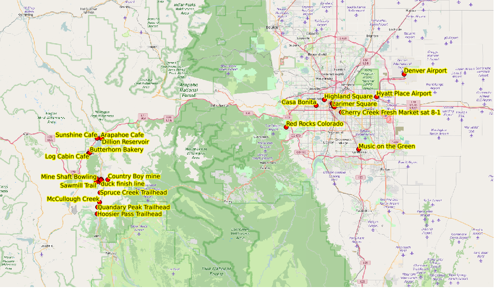

# Locations in Colorado

I've collected some waypoints in
[KML](files/copts.kml),
[GPX](files/copts.gpx),
[GeoJSON](files/copts.geojson), and
[CSV](files/copts.csv)
format.  You might need to select the Raw view to download them. Here's an overview

and a Breckenridge view

